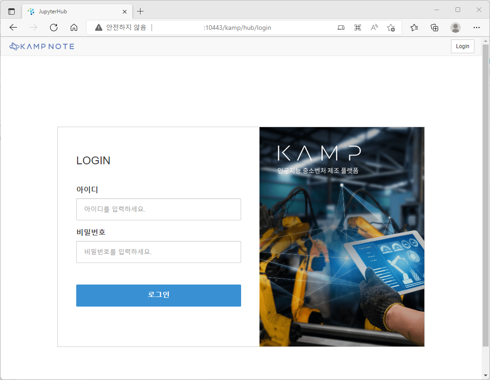

# 기업용 KAMP Note 초기 설정

## 기업용 KAMP Note URL

http://[제공받은 Floating IP]:10443/kamp

## 관리자 기능

기업용 KAMP Note의 관리자는 admin 계정으로 고정되어 있습니다.

해당 계정의 초기 비밀번호는 1234 입니다.

### 관리자 초기 화면

### admin 계정의 초기 비밀번호를 반드시 변경하여 이용하십시요.

## 관리자 - 사용자 관리

기업용 KAMP Note는 관리자가 KAMP Note 사용자를 추가/삭제 관리하도록 제공한다.

# 사용자 추가

## 일반 사용자 로그인 화면

관리자가 아닌 사용자는 다음과 같은 초기 화면이 표현됩니다.

